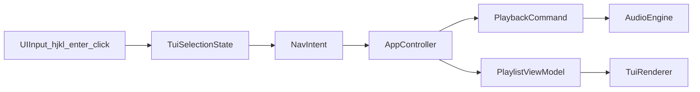

# 播放列表交互增强计划（Vim 风格）

## 目标与已确认交互
- 仅使用 Vim 风格切歌：`h`=上一首，`l`=下一首。
- 播放列表导航：`j/k` 移动光标选中。
- 切歌触发：选中后 **回车或鼠标点击** 才切歌（不会“移动即切歌”）。
- 预留用户键位配置接口：先实现默认内置配置 + 结构化配置入口，不在本次实现完整配置文件解析。

## 变更范围（文件）
- 播放状态与控制逻辑
  - [/home/virtualguard/vg101/dev/VocalPlayer/src/app/app_controller.hpp](/home/virtualguard/vg101/dev/VocalPlayer/src/app/app_controller.hpp)
  - [/home/virtualguard/vg101/dev/VocalPlayer/src/app/app_controller.cpp](/home/virtualguard/vg101/dev/VocalPlayer/src/app/app_controller.cpp)
- TUI 交互模型与渲染
  - [/home/virtualguard/vg101/dev/VocalPlayer/src/ui/tui_renderer.hpp](/home/virtualguard/vg101/dev/VocalPlayer/src/ui/tui_renderer.hpp)
  - [/home/virtualguard/vg101/dev/VocalPlayer/src/ui/tui_renderer.cpp](/home/virtualguard/vg101/dev/VocalPlayer/src/ui/tui_renderer.cpp)
- 键位配置占位（新增）
  - [/home/virtualguard/vg101/dev/VocalPlayer/src/ui/keybindings.hpp](/home/virtualguard/vg101/dev/VocalPlayer/src/ui/keybindings.hpp)
- 文档与测试
  - [/home/virtualguard/vg101/dev/VocalPlayer/README.md](/home/virtualguard/vg101/dev/VocalPlayer/README.md)
  - [/home/virtualguard/vg101/dev/VocalPlayer/README_zh-CN.md](/home/virtualguard/vg101/dev/VocalPlayer/README_zh-CN.md)
  - [/home/virtualguard/vg101/dev/VocalPlayer/tests/test_playlist.cpp](/home/virtualguard/vg101/dev/VocalPlayer/tests/test_playlist.cpp)
  - 新增交互单测：`tests/test_keybindings.cpp`（纯逻辑层）

## 设计方案

- 在 `TuiRenderer` 内新增“播放列表面板 + 当前播放高亮 + 光标选中高亮”。
- 事件层只产出“意图”（上一首/下一首/选择第 N 首），由 `AppController` 执行切歌。
- `AppController` 从“for 循环顺序播放”改为“可中断主循环 + 当前索引状态机”，支持运行时切歌。
- 预留 `Keybindings` 数据结构（默认映射 `h/l/j/k/Enter/q`），后续可对接配置文件。

## 实施步骤
1. **抽象交互意图与键位模型**
- 新增 `Keybindings` 与 `PlaybackAction`/`UiIntent` 枚举，提供默认键位映射函数。
- 将按键解析与业务动作解耦，避免硬编码散落在渲染层。

2. **升级 AppController 为可切歌状态机**
- 引入 `playlist`, `current_index`, `requested_index`, `exit_requested` 状态。
- 支持动作：上一首（边界钳制）、下一首（边界钳制）、跳转到选中曲目。
- 保留“解码失败跳过”的鲁棒性。

3. **重构 TuiRenderer 交互与布局**
- 新增左侧或下方播放列表区，显示曲目序号与名称。
- `j/k` 仅移动选中；`Enter` 才发起切歌。
- 鼠标点击列表项直接发起“选择并切歌”。
- `h/l` 发起上一首/下一首请求。

4. **联调与测试**
- 增加键位映射与索引边界的单测。
- 回归验证：单文件输入、目录输入、末尾/开头切歌、手动切歌与自然播放结束。

5. **文档更新**
- 更新中英文 README 交互说明与快捷键清单。
- 标注当前“键位配置接口”是预留结构（后续可接配置文件）。

## 验收标准
- 运行目录播放时，列表可见且可通过 `j/k` 移动选中。
- `Enter` 或鼠标点击列表项可切换到目标曲目。
- `h/l` 可在播放中切到上一首/下一首。
- 保持 `q` 退出会话行为。
- 所有测试通过，且无新增 lint 问题。