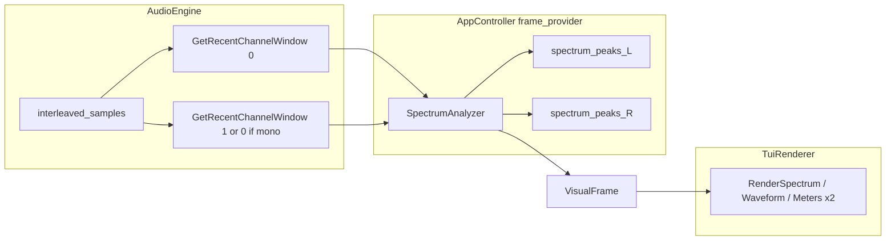

# Independent L/R visualization (full stereo path)

## Goals and constraints

- **Scope (confirmed):** L/R independent **spectrum**, **waveform/envelope**, **three band energies**, **RMS/Peak** — same analyzer pipeline as today, fed from **separate** windows instead of [`GetRecentMonoWindow`](src/audio/audio_engine.cpp).
- **Mono (`channels == 1`):** Both “L” and “R” panels show **the same** channel-0 analysis (duplicate panes, layout unchanged).
- **Non-goals for this iteration:** New `VisualMode` values, file-based persistence of stereo layout preference, or surround/multi-channel mapping beyond L/R.

## Architecture (data flow)

## 1) Audio extraction API

**File:** [`src/audio/audio_engine.hpp`](src/audio/audio_engine.hpp) / [`src/audio/audio_engine.cpp`](src/audio/audio_engine.cpp)

- Add `GetRecentChannelWindow(uint32_t channel_index, uint32_t window_size) const` returning `std::vector<float>` of length `window_size`, aligned in time with the existing mono window (same `current_frame_` / `start_frame` / `copy_frames` logic as [`GetRecentMonoWindow`](src/audio/audio_engine.cpp) lines 140–171).
- For each frame index `frame_index`, sample index is `frame_index * channels + channel_index` when `channel_index < channels`; otherwise return zeros (defensive).
- **Call-site policy (mono):** Controller passes `channel_index == 0` for both L and R; engine does not need a special-case duplicate flag.

Keep `GetRecentMonoWindow` initially for backward compatibility during the refactor, then remove once nothing references it (or keep as thin wrapper averaging L/R if useful for debug — prefer **remove** to avoid two sources of truth).

## 2) Shared contract: `VisualFrame`

**File:** [`src/shared/types.hpp`](src/shared/types.hpp)

- Introduce a small aggregate, e.g. `struct ChannelVisuals`, holding the fields that are today duplicated on `VisualFrame`: `spectrum_bars`, `spectrum_peak_bars`, `waveform_points`, `waveform_envelope_points`, `rms_level`, `peak_level`, `band_energies`.
- Change `VisualFrame` to carry `ChannelVisuals left` and `ChannelVisuals right` (and drop the flat vectors/scalars from `VisualFrame` once all consumers are updated).

This is the single contract between [`AppController`](src/app/app_controller.cpp) and [`TuiRenderer`](src/ui/tui_renderer.cpp).

## 3) Controller: dual analysis + dual peak hold

**File:** [`src/app/app_controller.cpp`](src/app/app_controller.cpp)

- Replace the single `spectrum_peaks` vector with **two** vectors (e.g. `spectrum_peaks_l`, `spectrum_peaks_r`) sized per respective `spectrum_bars` each tick, same decay logic as the current loop (lines ~106–115).
- Build `window_l` / `window_r`:
  - If `track_info.channels >= 2`: `GetRecentChannelWindow(0, k)` and `GetRecentChannelWindow(1, k)`.
  - Else: both from `GetRecentChannelWindow(0, k)`.
- Run `analyzer_` methods twice and assign `frame.left.*` / `frame.right.*`.
- `frame.visual_mode` remains `kOverview` as today (session override still lives in `TuiRenderer` / `UiSessionState`).

## 4) UI: L/R panel layout

**Files:** [`src/ui/tui_renderer.cpp`](src/ui/tui_renderer.cpp) (and small helpers in anonymous namespace if needed)

- Add thin builders, e.g. `RenderStereoSpectrum(left, right, theme)` → `hbox({ L_window, R_window })` using existing [`RenderSpectrum`](src/ui/tui_renderer.cpp) for each side with titles `Spectrum L` / `Spectrum R` (or a single outer window with inner split — pick one for consistent `window()` styling).
- Same pattern for **waveform** (each side uses its own `wave_source` from `left` vs `right`) and **meters** (duplicate the existing `vbox` block per side, possibly narrower `kMeterGaugeWidth` if terminal width becomes tight).
- Update `VisualMode` branches (lines ~357–372): each mode’s `visual_area` composes the stereo row(s) instead of single `spectrum_panel` / `waveform_panel` / `meters_panel`.

**UX note:** Overview becomes **wider** (six inner panels across one `hbox` may be unusable on small terminals). Mitigation in implementation: prefer **stacked stereo** for overview, e.g. `vbox({ hbox(L_spec, R_spec), hbox(L_wave, R_wave), hbox(L_meters, R_meters) })`, and keep focus modes as one stereo row + compact meters — tune during implementation with a quick directory smoke test.

## 5) Tests, format, build, docs

- **Tests:** Grep/update any compilation units that construct or touch `VisualFrame` (currently mainly UI/controller). Add or extend a **small** test if you extract channel deinterleave into a testable free function; otherwise rely on `ctest` plus manual TUI smoke on stereo and mono files.
- **Verification (repo rules):** `clang-format -i` on touched files; `cmake -S . -B build -DCMAKE_EXPORT_COMPILE_COMMANDS=ON && cmake --build build -j`; `ctest --test-dir build --output-on-failure`; TUI smoke with a stereo file and a mono file.
- **Docs (behavior change):** Sync [`README.md`](README.md), [`README_zh-CN.md`](README_zh-CN.md), [`docs/visual.md`](docs/visual.md) / [`docs/visual_zh-CN.md`](docs/visual_zh-CN.md), [`changelog.md`](changelog.md), and a short note in [`docs/dev/architecture.md`](docs/dev/architecture.md) (or sibling) describing the `ChannelVisuals` contract and `GetRecentChannelWindow` boundary.

## Risk and performance

- **CPU:** Roughly **2×** analyzer work per frame; acceptable at current window sizes; if needed later, add a cheap “stereo off” path (out of scope unless profiling shows issues).
- **Threading:** `GetRecentChannelWindow` remains `const` and reads the same atomics as mono — same thread-safety model as today.
