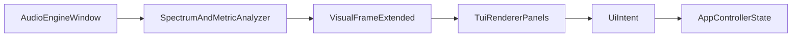

# v0.2.0 可视化与 UI 综合迭代计划

## 目标与边界

- 目标：在一次迭代内显著提升频谱/波形的观感与可读性，并引入“可扩展面板框架”以支持更多音频信息可视化。
- 你已确认的范围：
  - 尽量丰富可视化类型与面板（`full_explore`）。
  - 主题系统先做可扩展接口与内置能力，用户配置文件后置（`decide_later`）。
- 非目标：不实现用户主题配置文件解析；不展开长期 CUDA/Rust 方向。

## 现状基线（将复用的代码）

- UI 与交互主入口在 [`/home/virtualguard/vg101/dev/vocalplayer/src/ui/tui_renderer.cpp`](/home/virtualguard/vg101/dev/vocalplayer/src/ui/tui_renderer.cpp) 与 [`/home/virtualguard/vg101/dev/vocalplayer/src/ui/tui_renderer.hpp`](/home/virtualguard/vg101/dev/vocalplayer/src/ui/tui_renderer.hpp)。
- 可视化数据快照由 [`/home/virtualguard/vg101/dev/vocalplayer/src/shared/types.hpp`](/home/virtualguard/vg101/dev/vocalplayer/src/shared/types.hpp) 的 `VisualFrame` 承载。
- 数据生成与注入由 [`/home/virtualguard/vg101/dev/vocalplayer/src/app/app_controller.cpp`](/home/virtualguard/vg101/dev/vocalplayer/src/app/app_controller.cpp) 的 `frame_provider` 完成。
- 频谱/波形算法在 [`/home/virtualguard/vg101/dev/vocalplayer/src/analysis/spectrum_analyzer.cpp`](/home/virtualguard/vg101/dev/vocalplayer/src/analysis/spectrum_analyzer.cpp)。

## 方案总览（先稳接口，再做重视觉）

- 先扩展 `VisualFrame` 的“数据契约”，再重构 `TuiRenderer` 为面板化渲染，最后叠加主题与动画。
- 保持 `UiIntent -> AppController` 的控制链不变，避免交互回归。

## 实施阶段

### 阶段 A：数据契约扩展（低风险）

- 在 `VisualFrame` 增加可选/默认字段，用于承载新增可视化数据：
  - 电平类：`rms_level`、`peak_level`。
  - 频段类：`band_energy`（如低/中/高三段）。
  - 视图控制类：`visual_mode`（后续面板切换状态）。
- 在 `AppController` 的 `frame_provider` 中填充新字段，先用轻量算法（基于现有 mono window 的 O(n) 统计）。
- 保持所有新字段“缺省可渲染”，保证旧布局兼容。

### 阶段 B：TUI 面板化与布局升级（核心价值）

- 在 `TuiRenderer` 中将当前单体 `vbox` 拆为稳定区块：
  - 顶栏（曲目状态/时间/进度）。
  - 主可视化区（频谱 + 波形 + 新音频信息面板）。
  - 播放列表区（含状态提示）。
  - 底栏（快捷键与当前模式）。
- 去除与鼠标映射强耦合的固定行常量（如 `kPlaylistStartY`），改为基于组件结构的相对命中策略，避免后续加行导致点击偏移。
- 新增显示模式切换（例如 `Overview` / `SpectrumFocus` / `WaveFocus` / `Meters`），先用键盘切换并显示当前模式。

### 阶段 C：可视化效果升级（观感提升）

- 频谱：加入峰值保持（peak hold）与平滑衰减；可选对数分桶（至少保留一个模式）。
- 波形：提供“原始波形 + 包络（RMS/平滑）”两种显示态。
- 音频信息面板：至少接入 2 类新指标（建议 RMS 与 peak），并提供统一标尺显示。

### 阶段 D：主题系统 v1（不含用户文件）

- 引入 `Theme` 数据结构与内置主题枚举（如 `Default` / `Neon` / `Mono`）。
- 渲染逻辑只通过 `Theme` 取色，不在组件内写死颜色。
- 增加运行时切换主题的交互入口（键位或模式内切换），并在状态栏可见当前主题名。
- 预留配置扩展点：仅定义 `LoadThemeFromConfig` 接口占位，不实现文件解析。

### 阶段 E：质量门禁与文档同步

- 测试补充：
  - `analysis`：新增 RMS/peak/band 计算单测。
  - `ui`：关键纯函数（如模式切换、可视化映射）可测试部分补单测。
- 工程验证：`clang-format`、CMake 构建、`ctest` 全量通过。
- 文档同步：更新中英文 README、架构文档与 `changelog.md` 的 `Changed/Added`。

## 交付拆分（建议 PR/提交粒度）

- 切片 1：`VisualFrame` 扩展 + `AppController` 数据注入。
- 切片 2：`TuiRenderer` 面板化重构（保持旧功能等价）。
- 切片 3：新增指标与可视化效果。
- 切片 4：主题系统 v1 与交互入口。
- 切片 5：测试、文档、回归修复。

## 验收标准

- 功能：频谱/波形视觉增强可见；至少 2 个新增音频信息可视化项可稳定显示。
- 交互：现有键位行为不回退；新增模式/主题切换行为清晰可控。
- 稳定性：播放/切歌/暂停场景无明显闪烁、错位或崩溃。
- 性能：默认刷新下交互流畅，无显著卡顿；CPU 占用相较基线可接受。
- 文档：`README.md`、`README_zh-CN.md`、`docs/dev/architecture.md`、`docs/dev/architecture_zh-CN.md`、`changelog.md` 同步更新。
