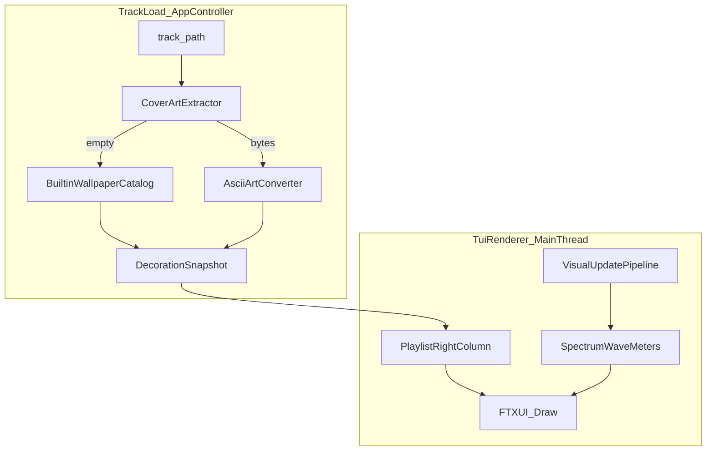

# v0.4.* 字符艺术装饰迭代计划

## 目标与边界

**目标（你已确认）**

- v0.4.0 **一次交付**：Playlist 右栏布局 + TagLib 封面提取 + 图像转 ASCII + 静态壁纸回退 + 缓存/异步。
- 壁纸切换：**不新增 `b`**；无封面时使用与 [`ThemeId`](src/ui/theme.hpp) 绑定的默认壁纸，按 `t` 换主题时同步换壁纸；**有封面时**不因换主题而替换封面图。
- 布局：以 [assets/demo1.png](assets/demo1.png) 为准，主位为 **Playlist 窗内右侧固定栏**（contain + 居中，不盖频谱、不做全屏背景）。

**明确不做（留给 longterm todo 51–53）**

- 视频/动态 ASCII 背景、工作目录自定义视频源、与频谱 Canvas 混绘。



---

## 1. 数据契约（先改头文件）

新增 `src/ui/decoration.hpp`（或拆成 `decoration_snapshot.hpp` + resolver），**不扩展** [`VisualFrame`](src/shared/types.hpp)：

```cpp
enum class DecorationSource { kEmbeddedCover, kBuiltinWallpaper, kNone };

struct DecorationSnapshot {
  std::vector<std::string> lines;  // 已分行、已 contain 到固定网格
  DecorationSource source = DecorationSource::kNone;
  std::string status_hint;         // "cover" | "wallpaper:Miku" | "no taglib"
  bool ready = false;              // 异步完成前 false → UI 显示占位
};
```

- [`UiSessionState`](src/ui/tui_renderer.hpp)：无需 `wallpaper_index`（`theme_only`）；保留现有 `theme_id` / `visual_mode`。
- 可选：在 `UiSessionState` 增加 `DecorationMode` 枚举占位（`kStatic`），供 longterm 动态引擎扩展，v0.4 可不实现切换。

---

## 2. 装饰子系统（`src/ui/` + `src/audio/`）

| 模块 | 职责 | 文件 |
|------|------|------|
| **CoverArtExtractor** | TagLib 读 front cover → `vector<uint8_t>` + mime | `src/audio/cover_art_extractor.hpp/.cpp` |
| **ImageDecoder** | JPEG/PNG → 灰度栅格 | `src/ui/image_decoder.hpp/.cpp`（`stb_image` 单头文件，放 `third_party/` 或 vendor） |
| **AsciiArtConverter** | 栅格 → 固定 `cols×rows` 字符画；**contain**；字符表默认 safe（` .:-=+*#%@`），可选 block 档后续再加 | `src/ui/ascii_art_converter.hpp/.cpp` |
| **BuiltinWallpaperCatalog** | 编译期嵌入 [`src/assets/ascii/`](src/assets/ascii/) 下 `{default,miku,teto}.txt`；`At(ThemeId)` 每主题 1 张默认 | `src/ui/builtin_wallpaper_catalog.hpp/.cpp` |
| **DecorationResolver** | 编排：有封面→转换；否则→Catalog；**LRU/路径+mtime 缓存** | `src/ui/decoration_resolver.hpp/.cpp` |
| **DecorationPipeline** | 仿 [`VisualUpdatePipeline`](src/ui/visual_update_pipeline.hpp)：worker 线程、`mutex` 发布最新 `DecorationSnapshot`、完成后 `PostEvent` 唤醒 UI | `src/ui/decoration_pipeline.hpp/.cpp` |

**CoverArtExtractor 要点**

- 仅在 `#ifdef VOCALPLAYER_HAS_TAGLIB` 内实现；否则直接返回空，由 Catalog 回退（与 [metadata.cpp](src/audio/metadata.cpp) 一致）。
- 格式：ID3v2 APIC（MPEG）、FLAC picture list、MP4 covr；取 `FrontCover`。
- 不修改现有 `MetadataReader::ReadTrackInfo` 职责；封面读取独立调用，避免耦合 title/artist。

**转换网格（与布局一致）**

- 默认输出：**28 列 × 10 行**（终端字宽高比按 ~2:1 采样，封面接近方形）。
- 失败/损坏图：回退 Catalog，不抛异常阻断播放。

---

## 3. 与 AppController / TuiRenderer 集成

**切歌点**（[`app_controller.cpp`](src/app/app_controller.cpp) 约 150–162 行，`ReadTrackInfo` 之后、`tui_renderer_.Run` 之前）：

1. 创建/重置 `DecorationPipeline`（或每曲 `ResolveOnce` + 取消上一任务）。
2. `ResolveAsync(track_path, ui_session_state.theme_id)`。
3. 向 `TuiRenderer::Run` 增加参数：`std::function<DecorationSnapshot()> decoration_provider`（与 `playlist_provider` 同模式）。

**`TuiRenderer::Run` 内**

- 启动/停止 `DecorationPipeline`（生命周期对齐 `VisualUpdatePipeline`）。
- `t` 换主题时（[`tui_renderer.cpp`](src/ui/tui_renderer.cpp) ~571 行）：若当前 `snapshot.source == kBuiltinWallpaper`，用新 `ThemeId` 同步 `Catalog::At(new_theme)`；若为 `kEmbeddedCover` 则**保留**当前 lines。
- 绘制：扩展 [`playlist_panel`](src/ui/tui_renderer.cpp)（约 493–501 行）为：

```text
window("Playlist",
  vbox({
    header_rows,           // 快捷键 + Selected 状态（全宽）
    separator(),
    hbox({
      playlist_rows | flex | reflect(playlist_rows_box),  // 仅左侧命中
      decoration_panel | size(WIDTH, EQUAL, kArtCols),   // 右栏固定
    }),
  }))
```

- `decoration_panel`：`window(text("Cover")|..., vbox(lines))`；`!ready` 时 `(loading…)`；`kNone` 时 `(no art)`。
- **鼠标**：`playlist_rows_box` 的 `reflect` 只挂在左侧 `playlist_rows`，避免点击落到 art 区。
- **终端分档**（`screen.dimx()` / `dimy()`）：宽 &lt; ~90 列隐藏右栏；footer 增加 `Art: hidden` 提示。高不足时仍优先保留列表行数。

**语义**

- 装饰始终表示 **正在播放曲目**（`current_track_index`），与列表选中（pending）无关；窗格标题用 `Cover` 即可。

---

## 4. 资源与构建

**目录**（运行时壁纸源文件；与仓库根 [`assets/`](assets/) 下仅用于 README 的 `demo*.png` 分离）

```text
src/assets/ascii/
  default.txt
  miku.txt
  teto.txt
```

- CMake：从 `src/assets/ascii/` 读取上述文件，以 `configure_file` / 生成嵌入头（`incbin` 风格）等方式打进二进制（优先 **编译期嵌入**，release 仍只需单个可执行文件，不依赖工作目录）。
- [CMakeLists.txt](CMakeLists.txt)：把新 `.cpp` 加入 `vocalplayer_core`；`stb_image` 仅 `image_decoder.cpp` 内 `#define STB_IMAGE_IMPLEMENTATION`。
- 版本号：`project(VERSION 0.4.0)`。

**Gumi / IA**

- **不纳入 v0.4.0**；在 [todo.md](todo.md) / changelog 标为 v0.4.1 可选项（扩 `ThemeId` + 壁纸 + 配色）。

---

## 5. 测试与验证

| 测试 | 内容 |
|------|------|
| `test_ascii_art_converter` | 固定小栅格 → 已知 ASCII 输出；contain 留白 |
| `test_builtin_wallpaper_catalog` | 每 `ThemeId` 非空、行宽 ≤ 28 |
| `test_decoration_resolver` | 无 TagLib 构建：回退壁纸；有 TagLib：用 fixture JPEG/PNG（`tests/fixtures/`） |
| 现有 | `ctest` 全绿 |

**手工**（仓库规则要求）

- 宽终端目录 smoke：有封面 mp3/flac + 无封面 wav；`t` 换主题验证壁纸变、封面不变。
- 窄终端（&lt;90 列）：右栏隐藏。
- Windows：UTF-8 块字符若异常，README 注明 safe 档为默认。

流程：`clang-format` → `cmake` build → `ctest` → 目录 smoke。

---

## 6. 文档同步

- [README.md](README.md) / [README_zh-CN.md](README_zh-CN.md)：封面 art、主题壁纸回退、`t` 行为、TagLib-off 说明；可选 `assets/demo4.png`。
- [docs/dev/architecture.md](docs/dev/architecture.md) / [architecture_zh-CN.md](docs/dev/architecture_zh-CN.md)：Decoration 子系统与数据流图。
- [changelog.md](changelog.md)：v0.4.0 Added/Changed。
- [todo.md](todo.md)：勾选 v0.4.* 并拆子项；longterm 动态引擎保持未勾选。

---

## 7. 实现顺序（推荐）

1. 契约 + `BuiltinWallpaperCatalog` + 静态资源嵌入  
2. `AsciiArtConverter` + `ImageDecoder` + 单元测试  
3. `CoverArtExtractor`（TagLib）  
4. `DecorationResolver` + `DecorationPipeline` + 缓存  
5. `AppController` 接线 + `TuiRenderer` Playlist 右栏与主题联动  
6. 文档 / changelog / 版本号 / smoke

---

## 风险与对策

| 风险 | 对策 |
|------|------|
| 大封面阻塞切歌 | 仅异步 worker；UI 占位 |
| MinGW 无 TagLib | 全路径回退壁纸；configure 提示 |
| 中日文文件名 + 封面路径 | 复用现有 UTF-8 path 约定 |
| Overview 高度紧张 | art 在 Playlist 右栏，不增加 visual 区高度 |
| 列表区变窄 | 仅宽终端显示右栏；文件名仍左对齐 flex |
