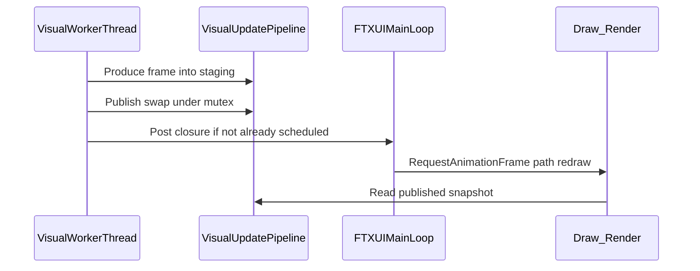

# Visual pipeline: fix post-lockscreen stutter

## Problem recap (root cause)

- [`TuiRenderer::Run`](src/ui/tui_renderer.cpp) uses a `refresh_thread` that every ~33ms calls `frame_provider()` (full dual-channel analysis) then [`screen.PostEvent(Event::Custom)`](src/ui/tui_renderer.cpp) (lines 587–614).
- FTXUI already injects **~15ms `AnimationTask`** and **~20ms stdin `Timeout`** into the **same unbounded task queue** ([`receiver.hpp`](build/_deps/ftxui-src/include/ftxui/component/receiver.hpp) push; [`RunOnce` / `RunOnceBlocking`](build/_deps/ftxui-src/src/ftxui/component/screen_interactive.cpp)).
- After **screen lock/unlock**, terminal input bursts and **slower `Draw`** (fullscreen + dual canvas) widen the gap between production and consumption → **queue backlog** and long `while (ReceiveNonBlocking)` drains → perceived slowdown (visual + time display cadence).

## Design choice (your “最优解” for analysis placement)

- **Keep FFT / dual-channel analysis on a worker thread** so the FTXUI main loop is not blocked by `SpectrumAnalyzer` work (avoids compounding with stdin parsing and animation tasks).
- **Stop using `PostEvent(Event::Custom)` for steady-state refresh**; replace with **at most one pending main-thread wakeup** per analysis completion using `ScreenInteractive::Post(Closure)` that calls `RequestAnimationFrame()` (FTXUI already rate-limits animation redraws internally; avoids one `Event` per tick piling up).

## New module: `VisualUpdatePipeline`

Add [`src/ui/visual_update_pipeline.hpp`](src/ui/visual_update_pipeline.hpp) and [`src/ui/visual_update_pipeline.cpp`](src/ui/visual_update_pipeline.cpp) (names can be adjusted to match repo style).

**Responsibilities**

- Own the **worker thread** lifecycle (`Start` / `Stop` / join on exit).
- Hold `std::function<VisualFrame()> produce_frame_` (injected from [`AppController`](src/app/app_controller.cpp) — same logic as today’s lambda body: windows, `FillChannelVisuals`, peaks L/R, `visual_mode`).
- **Publish model**: worker builds into a local `VisualFrame`, then under a **short mutex** move-assigns into `published_frame_` (or swap with a staging object). Renderer reads by **copying under the same mutex into a stack-local `VisualFrame`** before building FTXUI elements (copy cost bounded; avoids holding the lock across `Render`).
- **Coalesced wakeup**:
  - `std::atomic<bool> wake_posted_{false}`.
  - After publish, `if (!wake_posted_.exchange(true)) { screen.Post([this]{ wake_posted_.store(false); screen.RequestAnimationFrame(); }); }`  
  - Verify `Post(Closure)` from a background thread is the intended FTXUI usage (same path as other async tasks); adjust if profiling shows closure starvation.

**Optional “budget” hook (aggressive scope, phase 1 minimal)**

- Record `steady_clock::now()` around `produce_frame_`; if elapsed exceeds a threshold (e.g. 50ms), **extend sleep** before next iteration so the worker does not pin a core at 100% when the system is already behind (simple backpressure). Constants in one place for tuning.

**Playlist refresh**

- Today playlist + selection sync runs in the same thread as `frame_provider`. **Split**: worker thread updates **only** `VisualFrame`; keep a **lightweight** path on the main thread for playlist (either keep existing `playlist_provider()` calls inside `CatchEvent` / resize only, or a second coalesced low-rate `Post` — default: **invoke `playlist_provider()` once per main-loop redraw** before render, or at 10Hz via the same closure if you want zero extra thread traffic). Pick the simplest correct behavior: **refresh playlist snapshot on each successful Draw** from `playlist_provider()` so selection stays fresh without doubling background work.

## Refactor `TuiRenderer::Run`

- Remove inline `std::thread refresh_thread` + `PostEvent(Event::Custom)` block (lines 587–615).
- Construct `VisualUpdatePipeline` with `&screen`, `frame_provider`, target tick (33ms), `should_stop` callback wired to stop worker and `ExitLoopClosure` as today.
- Initial `latest_frame` / pipeline seed: either run one synchronous `produce` before `Loop` or have pipeline expose `GetSnapshot()` after `Start`.

## Refactor `AppController`

- Extract current lambda body (~[`FillChannelVisuals`](src/app/app_controller.cpp) + dual windows + peaks) into a **small functor or private method** that returns `VisualFrame`, passed to `VisualUpdatePipeline` as `std::function<VisualFrame()>`.
- Keep `spectrum_peaks_l/r` lifetime **per track** in `AppController` (captured by the functor), unchanged semantics.

## Build / tests / docs

- Register new `.cpp` in [`CMakeLists.txt`](CMakeLists.txt) `vocalplayer_core` sources.
- **Tests**: add `tests/test_visual_update_pipeline.cpp` (or similar) testing **coalescing invariant** with a fake `produce` counter and a mock “screen” seam — if mocking FTXUI is awkward, extract a tiny `CoalescingRedrawGate` class (atomic + callback injection) unit-tested without linking full FTXUI.
- **Verification**: `clang-format`, `cmake` build, `ctest`; manual smoke: play, lock screen, unlock, confirm UI cadence recovers without minutes-long catch-up.
- **Docs**: [`changelog.md`](changelog.md) + short subsection in [`docs/dev/architecture.md`](docs/dev/architecture.md) / [`docs/dev/architecture_zh-CN.md`](docs/dev/architecture_zh-CN.md) describing `VisualUpdatePipeline` and why `Event::Custom` was removed from the hot path.

## Risks / follow-ups (non-blocking)

- `RequestAnimationFrame` caps redraw differently than 30Hz `Custom`; if spectrum feels “too smooth” or slightly laggy, expose a **target FPS** constant on the pipeline (still coalesced).
- Further win: reuse buffers in [`GetRecentChannelWindow`](src/audio/audio_engine.cpp) to cut allocations (separate small PR if this one is large enough).
