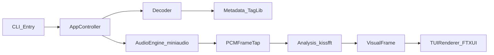

# VocalPlayer 架构雏形与 MVP 计划

## 目标与边界
- MVP 目标：实现本地音频播放、实时频谱/波形可视化、基础歌曲信息显示。
- 明确不做：情绪判定、播放列表管理、复杂交互（切歌/seek）等二期功能。
- 设计原则：渲染层与音频分析层解耦，后续可按模块逐步迁移到 Rust。

## 编码规范（Google C++ Style）
- 全项目统一采用 Google C++ Style。
- 在仓库根目录维护 `.clang-format`，并设置 `BasedOnStyle: Google` 作为基线。
- 命名约定默认遵循 Google 风格：类型 `PascalCase`、函数 `PascalCase`、变量 `snake_case`、常量 `kCamelCase`。
- 头文件要求自包含，尽量用前置声明减少依赖耦合，避免循环包含。
- 在 MVP 验收中增加风格项：新增/修改代码需通过 `clang-format` 检查，避免风格漂移。

## 架构雏形

- `CLI_Entry`：解析参数（输入文件、渲染刷新率、主题）。
- `AudioEngine_miniaudio`：负责播放状态机与音频输出。
- `PCMFrameTap`：从播放数据流抽取分析窗口（加窗 + hop）。
- `Analysis_kissfft`：计算频谱柱数据与波形采样，输出统一 `VisualFrame`。
- `TUIRenderer_FTXUI`：仅消费 `VisualFrame`，不依赖解码/播放细节。

## 代码目录与关键文件
- 项目说明与构建
  - [README.md](/home/virtualguard/vg101/dev/VocalPlayer/README.md)
  - [CMakeLists.txt](/home/virtualguard/vg101/dev/VocalPlayer/CMakeLists.txt)
- 入口与应用编排
  - [src/main.cpp](/home/virtualguard/vg101/dev/VocalPlayer/src/main.cpp)
  - [src/app/app_controller.hpp](/home/virtualguard/vg101/dev/VocalPlayer/src/app/app_controller.hpp)
  - [src/app/app_controller.cpp](/home/virtualguard/vg101/dev/VocalPlayer/src/app/app_controller.cpp)
- 音频与元信息
  - [src/audio/audio_engine.hpp](/home/virtualguard/vg101/dev/VocalPlayer/src/audio/audio_engine.hpp)
  - [src/audio/audio_engine.cpp](/home/virtualguard/vg101/dev/VocalPlayer/src/audio/audio_engine.cpp)
  - [src/audio/decoder.hpp](/home/virtualguard/vg101/dev/VocalPlayer/src/audio/decoder.hpp)
  - [src/audio/decoder.cpp](/home/virtualguard/vg101/dev/VocalPlayer/src/audio/decoder.cpp)
  - [src/audio/metadata.hpp](/home/virtualguard/vg101/dev/VocalPlayer/src/audio/metadata.hpp)
  - [src/audio/metadata.cpp](/home/virtualguard/vg101/dev/VocalPlayer/src/audio/metadata.cpp)
- 分析与渲染
  - [src/analysis/spectrum_analyzer.hpp](/home/virtualguard/vg101/dev/VocalPlayer/src/analysis/spectrum_analyzer.hpp)
  - [src/analysis/spectrum_analyzer.cpp](/home/virtualguard/vg101/dev/VocalPlayer/src/analysis/spectrum_analyzer.cpp)
  - [src/ui/tui_renderer.hpp](/home/virtualguard/vg101/dev/VocalPlayer/src/ui/tui_renderer.hpp)
  - [src/ui/tui_renderer.cpp](/home/virtualguard/vg101/dev/VocalPlayer/src/ui/tui_renderer.cpp)
  - [src/shared/types.hpp](/home/virtualguard/vg101/dev/VocalPlayer/src/shared/types.hpp)

## MVP 实施步骤
1. 初始化工程与依赖
- 建立 CMake 工程、可执行目标与第三方依赖接口（先本地 vendor 或系统库链接）。
- 约定统一数据结构：`AudioChunk`、`SpectrumBins`、`VisualFrame`、`TrackInfo`。
- 初始化 `.clang-format`（Google 风格）并在 README 中补充格式化命令。

2. 打通最小播放链路
- 实现 CLI：`vocalplayer <audio-file>`。
- 完成解码 + 播放（支持至少一种格式，优先 wav/mp3）。
- 提供最小状态回调：播放时间、总时长、是否结束。

3. 接入实时分析
- 在音频流里按固定窗口（如 1024/2048）抽样。
- 输出 32~64 个频段柱状值 + 简化波形点。
- 增加平滑（EMA）避免闪烁。

4. 完成 TUI 可视化
- 绘制顶部歌曲信息（标题/艺术家/进度）。
- 绘制中部频谱柱和底部波形。
- 设定稳定刷新（如 20~30 FPS），保证 CPU 占用可接受。

5. 收尾与验收
- 在 README 写明构建、运行、参数与已知限制。
- 增加最小测试（至少对分析模块做静态输入输出断言）。
- 定义二期接口占位（情绪映射模块空壳）。

## 验收标准（Done）
- 可通过命令启动并播放本地音频。
- 播放过程中终端持续显示实时频谱/波形。
- 歌曲信息与播放进度可见。
- 工程可一键构建并在 README 指引下复现。

## Rust 迁移前置设计
- 从 MVP 起保持 `analysis` 与 `ui` 通过纯数据结构通信。
- 避免在渲染层使用任何音频库类型，全部转成 `shared/types.hpp`。
- 二期优先迁移 `analysis` 到 Rust，再通过 FFI 接回 C++ 主程序。