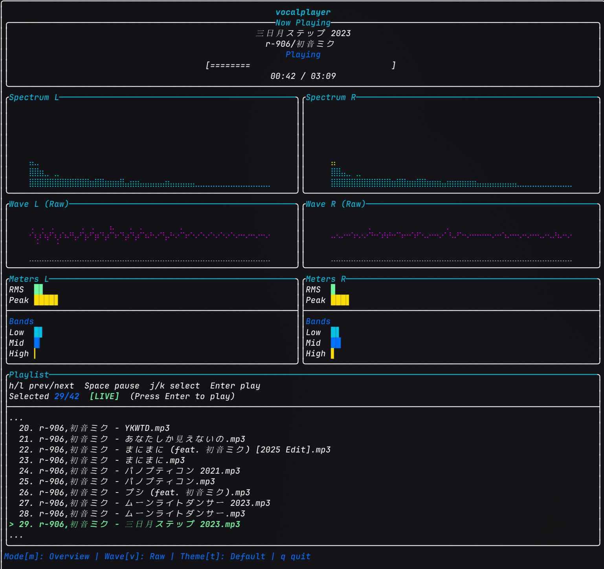
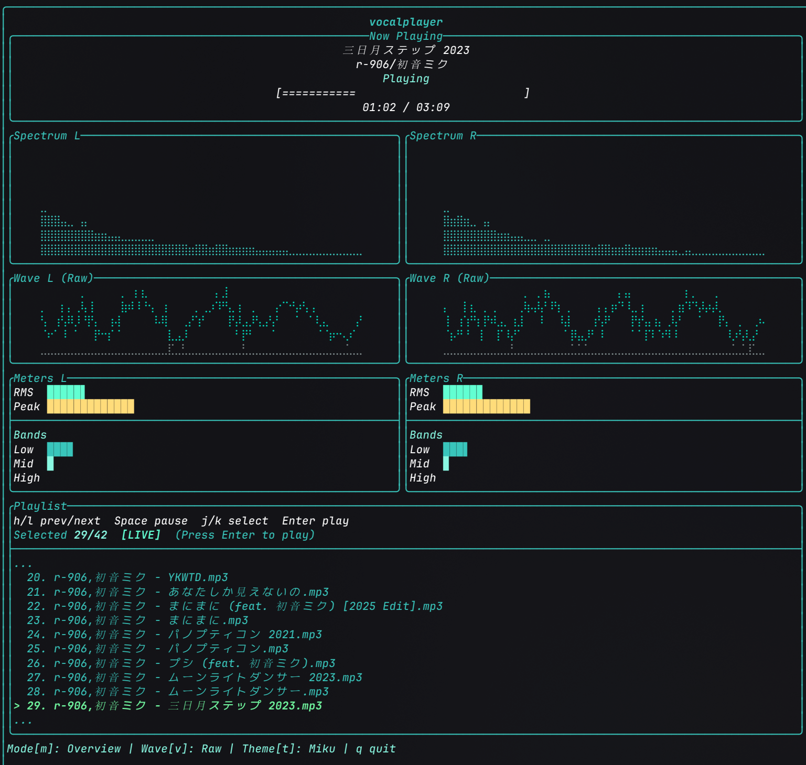
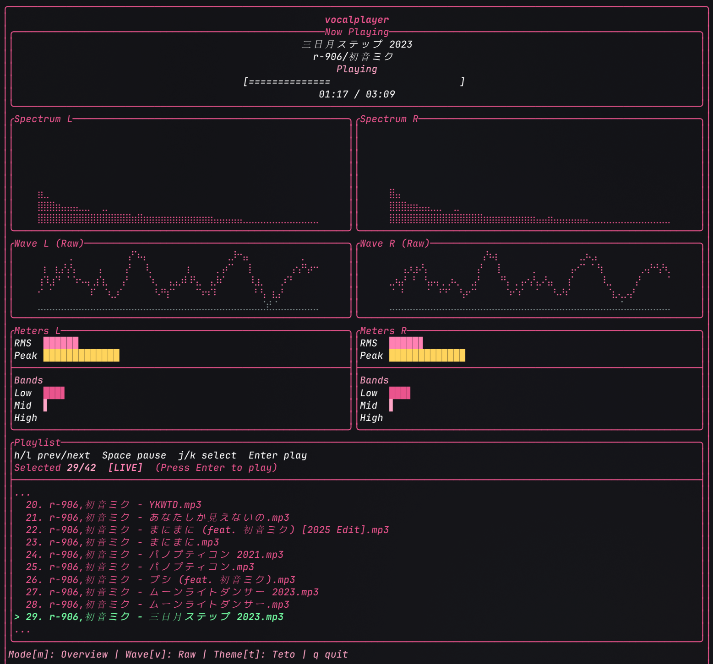

<div align="center">

# vocalplayer

[English](README.md) | 简体中文

基于C++的创意型CLI音乐播放器，在终端中实现实时节奏可视化。





</div>

vocalplayer 是一个使用 C++ 构建的创意型 CLI 音乐播放器，重点在于终端中的实时节奏可视化。

## 特性

- 本地音频播放（`wav` 及 miniaudio 解码器支持的格式）。
- 目录扫描 + 简单的按名称排序播放列表。
- TUI 实时频谱柱（含峰值保持）与双模式波形渲染，左右声道独立分析（单声道
  复制声道 0 到两侧）。
- 左右独立的音频信息仪表（RMS、Peak、低/中/高频段能量）。
- 曲目信息展示（`title`、`artist`、时长；TagLib 可选）。
- 支持 Vim 风格播放列表交互（`h/l/j/k`）与回车确认切歌。
- 支持可视化布局模式切换与内置主题运行时切换。

## 运行

```bash
./vocalplayer /path/to/song.wav
./vocalplayer /path/to/music-directory
```

在 TUI 中按 `q` 可退出当前会话。

## 交互

### 播放交互

- `h`：上一首
- `l`：下一首
- `Space`：暂停/恢复当前曲目
- `j`：播放列表选中下移
- `k`：播放列表选中上移
- `m`：循环切换可视化布局模式
- `v`：切换波形样式（`Raw` / `Envelope`）
- `t`：循环切换内置主题（`Default` / `Miku` / `Teto`）
- 鼠标滚轮：滚动播放列表视窗
- 鼠标左键点击列表项：仅选中该曲目
- `Enter`：播放当前选中曲目
- `q`：退出

### 键位配置接口（预留）

`src/ui/keybindings.hpp` 中定义了 `Keybindings` 结构和
`DefaultKeybindings()`。后续可在该接口基础上接入用户自定义配置文件。

## 开发

### LSP / clangd 配置

如果你在 C++ 文件里看到大量类似“header not found”的错误，通常是
clangd 没拿到编译数据库（`compile_commands.json`）。

建议使用[Just](https://github.com/casey/just)进行快速配置：

```bash
just bootstrap
```

随后重载 IDE 窗口，让 clangd 重新索引。

### 依赖

- CMake >= 3.20
- vcpkg（用于管理第三方库）
- C++20 编译器（`clang++` 或 `g++`）
- 可选：TagLib 开发包（用于更完整的元数据读取）

CMake 会自动拉取以下第三方库：

- `miniaudio`
- `kissfft`
- `FTXUI`

### Windows 说明

- 为了正确显示中文/日文等元数据，请使用支持 UTF-8 的终端与字体
  （例如 Windows Terminal + CJK 字体）。
- CMake 现在按以下顺序查找 TagLib：
  1. `find_package(TagLib CONFIG)`
  2. `pkg-config taglib` 回退
- 若未找到 TagLib，程序仍可运行，但会回退为文件名标题和
  `Unknown Artist`。

### 构建

```bash
just bd # build debug
just br # build release
```

### 交叉编译（Linux → Windows，MinGW）

在 Linux 上使用与日常构建相同的 **vcpkg manifest**，目标 triplet 为社区
**`x64-mingw-static`**，并通过 **`mingw-w64-vcpkg-chainload.cmake`** 固定
`x86_64-w64-mingw32-*` 编译器前缀、将 **`CMAKE_SYSTEM_NAME` 设为 `Windows`**，
以及固定 MinGW 的 `pkg-config` 搜索路径（避免混入宿主 Linux 的 TagLib 头文件）。

前置条件：已 bootstrap 的 vcpkg（设置 **`VCPKG_ROOT`**，基线尽量与
`vcpkg-configuration.json` 一致）、`cmake`、推荐 `ninja`、MinGW-w64 工具链；若希望
`ctest` 在构建后运行测试，请安装 **Wine**。

**`x64-mingw-static`** 的 manifest 依赖安装在 **`<构建目录>/vcpkg_installed/`**
（默认 **`build-win/vcpkg_installed/`**），仓库根下的 **`vcpkg_installed/x64-linux`**
仍供 `just bootstrap` / `debug` / `release` 使用。交叉预设默认关闭 TagLib 探测
（**`VOCALPLAYER_FIND_TAGLIB=OFF`**），元数据走文件名回退；若日后通过 vcpkg 提供
MinGW 版 TagLib，可自行改为 `ON`。

```bash
export VCPKG_ROOT=/path/to/vcpkg
just cw
# 等价：./scripts/build-windows.sh
# 或：cmake --preset mingw-cross && cmake --build build-win -j
```

### 贡献

贡献流程相关内容参见[`contributing_zh-CN.md`](contributing_zh-CN.md)（[English](contributing.md)）。

