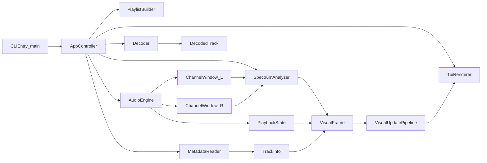
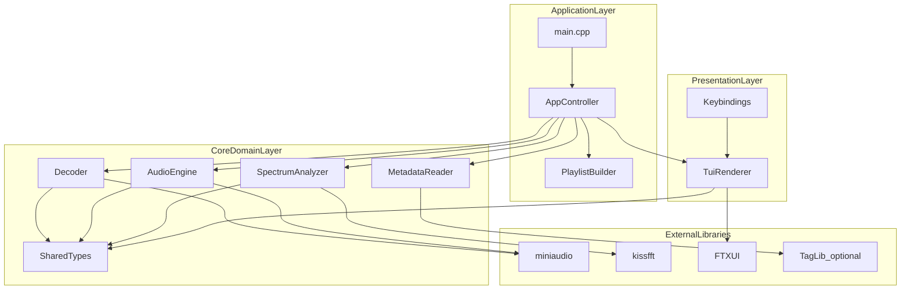
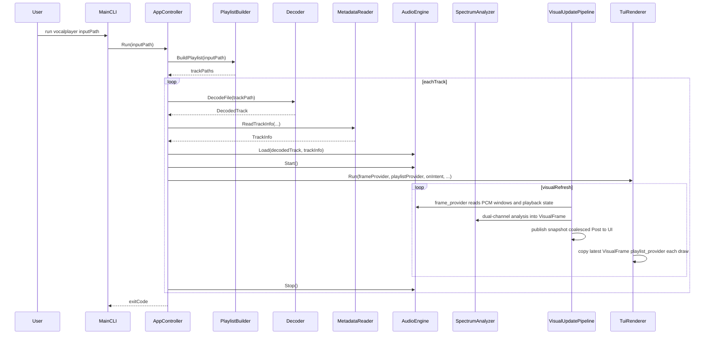
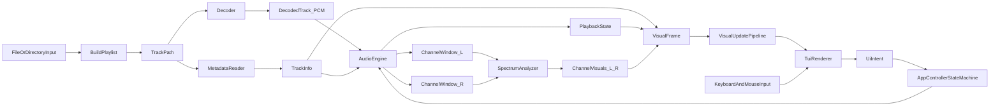

# VocalPlayer Architecture

## Scope

This document records the runtime architecture for the current VocalPlayer MVP
and acts as a stable reference for future features.

Implemented scope:

- File or directory input.
- Decoding + playback via miniaudio.
- Real-time spectrum (with peak-hold) and dual waveform rendering in terminal,
  analyzed independently for left/right channels (mono duplicates channel 0).
- Meter panels for RMS/Peak and low/mid/high frequency band energy per side.
- Playlist interactions (`h/l`, `j/k`, `Space`, `Enter`, mouse select/scroll).
- View-mode switching (`m`), waveform style toggle (`v`), and theme cycling (`t`).
- Optional metadata enrichment via TagLib.

## Component Diagram

## Component Responsibilities

- `main.cpp`
  - Parses CLI argument and delegates control to `AppController::Run()`.
- `AppController`
  - Owns the session state machine.
  - Coordinates decode, playback, analysis, and UI intents.
- `BuildPlaylist()`
  - Resolves input path into a sorted list of supported audio files.
- `Decoder`
  - Produces `DecodedTrack` (interleaved float PCM).
  - Handles known-length and chunked fallback reads.
- `MetadataReader`
  - Creates `TrackInfo` from decoder metadata and optional TagLib tags.
- `AudioEngine`
  - Streams PCM to output device and tracks playback cursor/state.
  - Exposes pause/resume and analysis window extraction.
- `SpectrumAnalyzer`
  - Converts per-channel time windows into spectrum bars, peak-hold hints,
    waveform points, envelope waveform points, and meter values.
- `TuiRenderer`
  - Renders panelized terminal layout (header/visual area/playlist/footer).
  - Maps key/mouse input into `UiIntent` events.
  - On each draw, refreshes the playlist snapshot from `playlist_provider()` on
    the main thread; consumes the latest `VisualFrame` from `VisualUpdatePipeline`.
- `VisualUpdatePipeline`
  - Runs `frame_provider` on a worker thread, publishes under a mutex, and
    schedules coalesced redraw requests to the active `ScreenInteractive`.
  - Applies light backoff when analysis exceeds a configurable wall-time budget.
- `CoalescingRedrawGate`
  - Ensures at most one pending redraw callback is armed until the UI marks it
    flushed (used by `VisualUpdatePipeline`).

## Interface Inventory

- Application interfaces
  - `int AppController::Run(const std::string& input_path)`
  - `std::vector<std::string> BuildPlaylist(const std::string& input_path)`
- Audio interfaces
  - `DecodedTrack Decoder::DecodeFile(const std::string& path) const`
  - `TrackInfo MetadataReader::ReadTrackInfo(...) const`
  - `AudioEngine::{Load, Start, Pause, Resume, TogglePause, Stop}`
  - `PlaybackState AudioEngine::GetPlaybackState() const`
  - `std::vector<float> AudioEngine::GetRecentChannelWindow(uint32_t channel_index, uint32_t) const`
- Analysis interface
  - `std::vector<float> SpectrumAnalyzer::ComputeBars(...)`
  - `std::vector<float> SpectrumAnalyzer::ComputeWaveform(...) const`
  - `std::vector<float> SpectrumAnalyzer::ComputeWaveformEnvelope(...) const`
  - `AudioLevels SpectrumAnalyzer::ComputeLevels(...) const`
  - `std::vector<float> SpectrumAnalyzer::ComputeBandEnergies(...) const`
- UI interfaces
  - `void TuiRenderer::Run(...)`
  - `VisualUpdatePipeline` (constructed per `Run` session; worker + coalesced redraw)
  - `CoalescingRedrawGate` (at-most-one pending redraw arm until flushed)
  - `UiIntent` enum for playback/navigation intents
  - `Keybindings` + `DefaultKeybindings()` for configurable key mapping
  - `ThemeId` / `Theme` for runtime built-in theme palettes

## Overall Architecture Diagram

## Sequence Diagram (Single Track Session)

## Data Flow Diagram

## Runtime Data Flow Notes

- Data is intentionally one-directional for rendering:
  `AudioEngine -> SpectrumAnalyzer -> VisualFrame` (assembled and published by
  `VisualUpdatePipeline` on a worker thread), then copied into `TuiRenderer` on
  each draw alongside `playlist_provider()` results.
- Control travels in the opposite direction:
  `UserInput -> TuiRenderer -> UiIntent -> AppController`.
- `VisualFrame` is immutable per tick, reducing cross-module coupling and easing
  Rust migration.
- `AudioEngine` is the single source of truth for elapsed position and play
  state (`playing`, `paused`, `finished`).

## Data Contracts

- `DecodedTrack`: interleaved float PCM plus stream format.
- `TrackInfo`: source and display metadata for active track.
- `PlaybackState`: elapsed time, duration, and runtime flags.
- `ChannelVisuals`: per-channel spectrum, waveforms, RMS/Peak, and band meters.
- `VisualFrame`: complete UI tick payload with `left`/`right` channel visuals
  plus preferred visual mode.

## Planned Evolution

- Theme system with configurable style presets.
- LRC timeline parser and lyric sync renderer.
- Beat-driven pulse effects.
- Rule-based emotion tags, then model-based inference.
