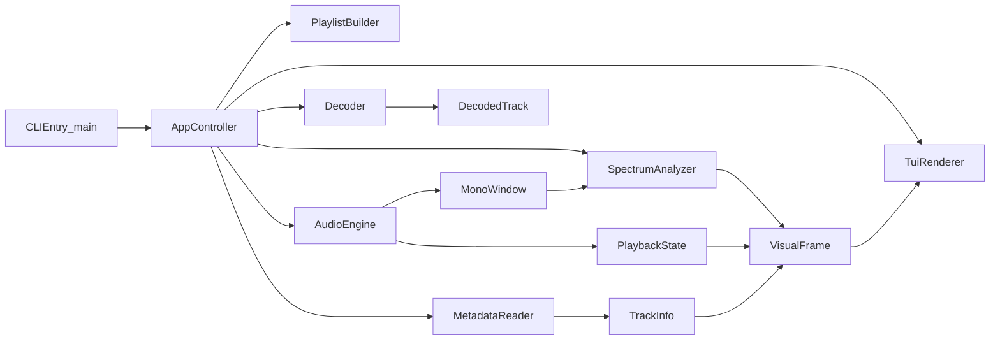
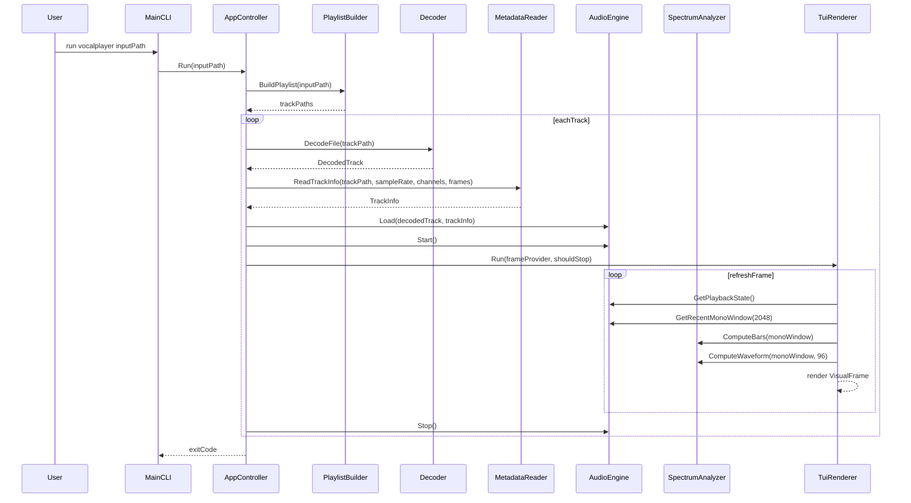
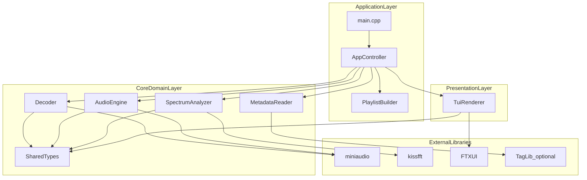

# VocalPlayer Architecture

## Scope

This document records the current architecture of VocalPlayer MVP and serves as
the baseline for future iterations (theme system, lyric sync, and emotion
mapping).

Current implemented scope:

- Input: single audio file or audio directory.
- Playback: local decoded buffer playback via miniaudio.
- Visualization: real-time spectrum bars and waveform in FTXUI.
- Metadata: title and artist from TagLib (optional) with fallback strategy.

## Component Diagram

## Sequence Diagram (Single Track)

## Overall Architecture Diagram

## Data Contracts

- `DecodedTrack`: interleaved float samples and stream format info.
- `TrackInfo`: source path, title, artist, duration, sample format metadata.
- `PlaybackState`: elapsed and duration plus runtime flags.
- `VisualFrame`: UI-facing immutable snapshot assembled every refresh tick.

This contract-oriented approach allows Rust migration by replacing module
implementations while preserving stable data boundaries.

## Runtime Notes

- Current loop model is single track at a time, sequence playback for playlist.
- Pressing `q` exits current TUI session and stops remaining playlist playback.
- Decoder has both known-length and chunked fallback read paths for broader
  format compatibility.

## Planned Evolution

- Theme system: configurable rendering style and color palettes.
- Lyric timeline: LRC parsing and synchronized line rendering.
- Beat pulse: lightweight onset-driven visual triggers.
- Emotion mapping: rule-based labels first, model-based inference later.
