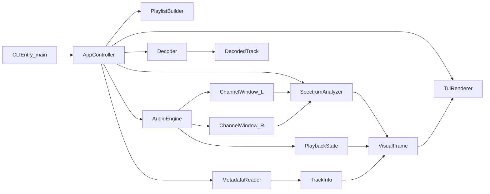
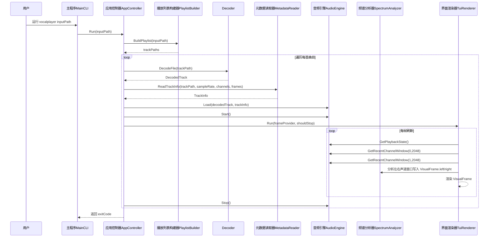
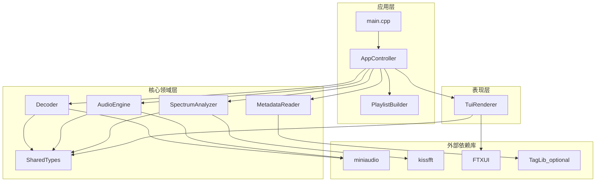
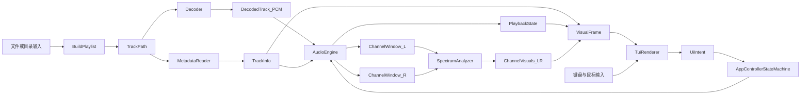

# VocalPlayer 架构文档

## 范围说明

本文档用于记录 VocalPlayer 当前 MVP 的架构设计，并作为后续迭代
（主题系统、歌词同步、情感映射）的基线文档。

当前已实现范围：

- 输入：支持单个音频文件或音频目录。
- 播放：通过 miniaudio 执行本地解码缓冲播放。
- 可视化：通过 FTXUI 实现频谱柱（含峰值保持）与双模式波形渲染；左右声道
  独立分析（单声道复制声道 0）。
- 仪表：左右声道分别显示 RMS/Peak 与低中高频段能量。
- 元数据：优先通过 TagLib 读取标题与艺术家（可选），并提供回退策略。
- 交互：支持 `h/l`、`j/k`、`Space`、`Enter` 及鼠标选择/滚轮滚动。
- 模式：支持 `m` 切换可视化布局、`v` 切换波形样式、`t` 切换主题。

## 组件图

## 时序图（单曲播放）

## 整体架构图

## 组件职责说明

- `main.cpp`
  - 解析命令行参数，并将控制权交给 `AppController::Run()`。
- `AppController`
  - 维护会话状态机。
  - 协调解码、播放、分析与 UI 意图处理。
- `BuildPlaylist()`
  - 将输入路径解析为可播放音频列表并排序。
- `Decoder`
  - 输出 `DecodedTrack`（交错 float PCM）。
  - 支持已知长度和分块回退解码。
- `MetadataReader`
  - 基于路径与可选 TagLib 元数据构建 `TrackInfo`。
- `AudioEngine`
  - 驱动音频输出设备并维护播放游标/状态。
  - 提供暂停恢复与分析窗口提取能力。
- `SpectrumAnalyzer`
  - 将各声道时域窗口转换为频谱柱、峰值提示、波形点、包络波形与仪表指标。
- `TuiRenderer`
  - 以面板化布局渲染终端界面（顶栏/主可视化区/播放列表/底栏）。
  - 将键鼠输入转换为 `UiIntent`。

## 接口清单

- 应用层接口
  - `int AppController::Run(const std::string& input_path)`
  - `std::vector<std::string> BuildPlaylist(const std::string& input_path)`
- 音频层接口
  - `DecodedTrack Decoder::DecodeFile(const std::string& path) const`
  - `TrackInfo MetadataReader::ReadTrackInfo(...) const`
  - `AudioEngine::{Load, Start, Pause, Resume, TogglePause, Stop}`
  - `PlaybackState AudioEngine::GetPlaybackState() const`
  - `std::vector<float> AudioEngine::GetRecentChannelWindow(uint32_t channel_index, uint32_t) const`
- 分析层接口
  - `std::vector<float> SpectrumAnalyzer::ComputeBars(...)`
  - `std::vector<float> SpectrumAnalyzer::ComputeWaveform(...) const`
  - `std::vector<float> SpectrumAnalyzer::ComputeWaveformEnvelope(...) const`
  - `AudioLevels SpectrumAnalyzer::ComputeLevels(...) const`
  - `std::vector<float> SpectrumAnalyzer::ComputeBandEnergies(...) const`
- 表现层接口
  - `void TuiRenderer::Run(...)`
  - `UiIntent`（播放与导航意图枚举）
  - `Keybindings` + `DefaultKeybindings()`（键位映射入口）
  - `ThemeId` / `Theme`（内置主题与配色约定）

## 数据流图

## 运行时数据流说明

- 渲染链路保持单向：
  `AudioEngine -> SpectrumAnalyzer -> VisualFrame -> TuiRenderer`。
- 控制链路反向回传：
  `用户输入 -> TuiRenderer -> UiIntent -> AppController`。
- `VisualFrame` 作为每帧不可变快照，降低模块耦合，利于后续 Rust 迁移。
- `AudioEngine` 是播放状态单一事实来源（播放中、暂停、结束）。

## 数据契约

- `DecodedTrack`：交错存储的浮点采样与流格式信息。
- `TrackInfo`：来源路径、标题、艺术家、时长和采样相关元信息。
- `PlaybackState`：已播放时间、总时长及运行态标记。
- `ChannelVisuals`：单侧频谱、波形、RMS/Peak 与频段能量等可视化快照。
- `VisualFrame`：每个刷新周期的 UI 只读快照，包含 `left`/`right` 两组
  `ChannelVisuals` 与首选可视化模式。

这种“数据契约优先”的设计，使后续迁移到 Rust 时可以在保持边界稳定的前提下，
替换具体模块实现。

## 运行时说明

- 当前循环模型为“单曲渲染 + 顺序播放列表”。
- 在 TUI 中按 `q` 会退出当前会话，并停止后续曲目播放。
- 解码器同时支持已知总长度读取和分块回退读取，以兼容更多音频文件。

## 后续演进方向

- 主题系统：可配置渲染风格与配色方案。
- 歌词时间轴：LRC 解析与同步行渲染。
- 节拍脉冲：轻量级起音驱动视觉触发。
- 情感映射：先规则映射，再模型推断。
