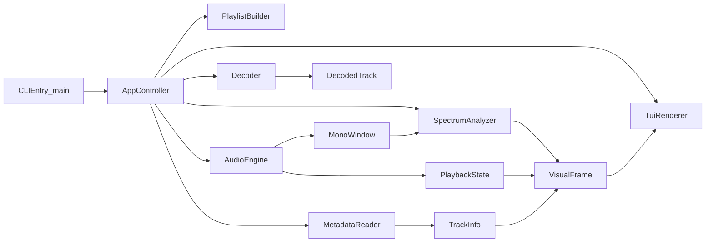
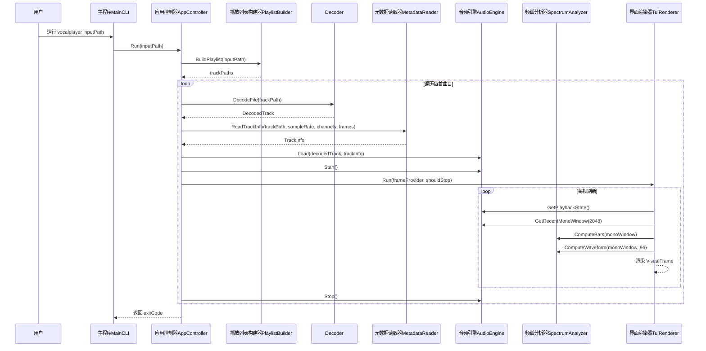
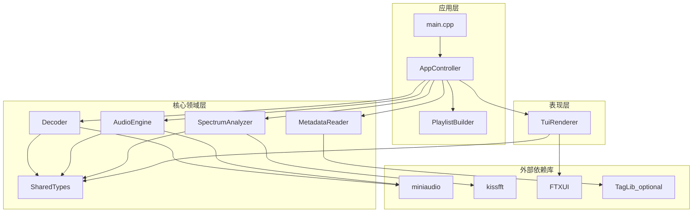

# VocalPlayer 架构文档

## 范围说明

本文档用于记录 VocalPlayer 当前 MVP 的架构设计，并作为后续迭代
（主题系统、歌词同步、情感映射）的基线文档。

当前已实现范围：

- 输入：支持单个音频文件或音频目录。
- 播放：通过 miniaudio 执行本地解码缓冲播放。
- 可视化：通过 FTXUI 实现实时频谱柱与波形渲染。
- 元数据：优先通过 TagLib 读取标题与艺术家（可选），并提供回退策略。

## 组件图

## 时序图（单曲播放）

## 整体架构图

## 数据契约

- `DecodedTrack`：交错存储的浮点采样与流格式信息。
- `TrackInfo`：来源路径、标题、艺术家、时长和采样相关元信息。
- `PlaybackState`：已播放时间、总时长及运行态标记。
- `VisualFrame`：每个刷新周期生成的 UI 只读快照。

这种“数据契约优先”的设计，使后续迁移到 Rust 时可以在保持边界稳定的前提下，
替换具体模块实现。

## 运行时说明

- 当前循环模型为“单曲渲染 + 顺序播放列表”。
- 在 TUI 中按 `q` 会退出当前会话，并停止后续曲目播放。
- 解码器同时支持已知总长度读取和分块回退读取，以兼容更多音频文件。

## 后续演进方向

- 主题系统：可配置渲染风格与配色方案。
- 歌词时间轴：LRC 解析与同步行渲染。
- 节拍脉冲：轻量级起音驱动视觉触发。
- 情感映射：先规则映射，再模型推断。
